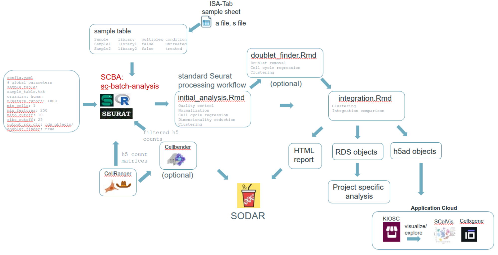

# sc-batch-analysis
Initial steps in the automated analysis of single cell RNA-seq datasets

This is a collection of R markdowns that allows automation of the initial analysis of cellranger-processed datasets. h5 files from the `cellranger` output are input into the R markdown and standard pre-processing Seurat pipeline is performed. Quality control metrics are plotted and two different approaches for the regression of cell cycle genes is evaluated. RDS objects are stored for easy further downstream processing. Optionally, doublets are removed by Doublet Finder and standard Seurat pre-processing is rerun. In the next step, the output of several methods for data integration are evaluated.



Prerequisites:
- h5 files from `cellranger` output
- support for organisms is limited to mouse and human
- a sample table that specifies sample, cellranger_run and multiplexing oligos (if any)
- a conda environment with the following: snakemake, Seurat, dplyr, tidyr, gtools, ggplot2, hdf5r, Matrix, fields, parallel, ROCR, KernSmooth, DoubletFinder, devtools. The provided file `conda_environment_seurat.yaml` can be used to build the environment like this:

Quick start:
```
git clone --branch dev https://github.com/bihealth/sc-batch-analysis
cd sc-batch-analysis
mamba env create -n R-fixed-scba -f scba_env.yaml
```
Once that is done install the DoubletFinder within R by running 
`Rscript install_R_packages.R`


General usage: 
- Activate the conda environment created above.
- Make sample table using the helper script `make_sample_table.R` or manually.
- Edit the config.yaml file to edit the parameters of the pipeline run.
- Make sure the directory `slurm_logs` exists, where the logs will be written.
- Use the bash script run_snakemake.sh to submit a batch job to the Slurm scheduler that will run snakemake and render the R markdown files. The parameters can be passed from the config.yaml file to the R markdown. Rendering of the R markdown results in the creation of RDS objects and an HTML report file.

Even quicker start:
To create a sample table, a helper script is provided that will detect h5 files in a given directory. 
```
conda activate R-fixed-scba
Rscript make_sample_table.R --h5_path /path/to/h5_files --afile /path/to/afile --sfile /path/to/sfile --out sample_table.txt
```
Check `sample_table.txt` to see that it has the correct content. Then edit the `config.yaml` file.
Once done, start the pipeline run.
```
sbatch run_snakemake.sh
```
Have fun!


How the sample table should look: 
- should be a tab separated value (.tsv) file
- should have a header and include at least 4 columns with the following names: `sample`, `library` and `multiplex` and `file`.
- if `raw_file` is provided
- can contain optional columns e.g. `condition`, `treatmen`, `source_name`, `mouse`, `cell_manipulation`. The names of these columns can be user-defined.

`multiplex` column should contain the name of the hashtag oligonucleotide as specified in the feature reference of the `cellranger` run (e.g. TotalSeq_C0301, CMO301). In case no demultiplexing should be performed, the multiplex column should contain 'false', 'No' or 'NA' for all samples.

Some examples of sample tables can be found in the `èxamples` directory.

Have a look at `Rscript make_sample_table.R -h` to get an idea of helpful parameters.
```
Usage: make_sample_table.R [options]
Creates sample table for sc-batch-analysis starting from directory containing h5 files

Options:
        -h, --help
                Show this help message and exit

        --h5_path=H5_PATH
                directory with h5 files (required)

        --regexp_filename=REGEXP_FILENAME
                regular expression for looking up h5 files, if not specified '[de]_feature_bc_matrix.h5$' will be used

        --afile=AFILE
                isa-tab assay file (required)

        --sfile=SFILE
                isa-tab study file (required)

        --out=OUT
                output sample table filename

        --raw_h5_path=RAW_H5_PATH
                directory with h5 files, if not specified, raw h5 files will not be included in the sample table/analysis
 (optional)

        --regexp_filename_raw=REGEXP_FILENAME_RAW
                regular expression for looking up raw h5 files, default raw_feature_bc_matrix.h5$'

```

Config.yaml parameter description:

Global parameters

sample_table: sample_table.txt # a tab-separated file, look at examples in the examples directory

organism: human

nFeature_cutoff: 4000 # filtering based on number of genes per cell, usually has to be determined empirically, 5000 is a good starting value

min_cells: 1 # CreateSeuratObject() parameter

min_features: 250

mito_cutoff: 10

ribo_cutoff: 25

output_rds_dir: rds_objects/ # trailing slash is necessary

doublet_finder: true # depending on this the doublet finder rule will be executed or not, should be false, when HTO multiplexing was performed, otherwise true


Initial analysis parameters

output_initial_html: out/initial_analysis.html # name of the output html for initial analysis

title_initial: 'Initial analysis 111122' # title of the initial analysis report


Doublet finder parameters

output_df_html: out/doublet_finder.html # name of the output html for doublet finder analysis

input_df_object: sobj.diff.cc.rds # input rds object from initial analysis, can be either 'sobj.rds', 'sobj.separate.cc.rds' or 'sobj.diff.cc.rds'. Names correspond to how cell cycle regression scores were used during initial analysis.

title_df: 'Doublet finder report 111122' # title of the doublet finder report

split_by: sample # how should the seurat object be split before doublet finder analysis, corresponds to a column name in sample_table.txt, should almost always be 'sample'

doublet_formation_rate: 0.05 # this is a parameter for doublet finder, typically 0.05


Integration parameters

output_integration_html: out/integration.html # name of the output html for integration analysis

input_integration_object: sobj.df.diff.cc.rds # input rds object from initial analysis, depends on whether the doublet finder analysis is performed or not. can be either 'sobj.rds', 'sobj.separate.cc.rds', 'sobj.diff.cc.rds', 'sobj.df.rds', 'sobj.df.separate.cc.rds' or 'sobj.df.diff.cc.rds'. Names correspond to how cell cycle regression scores were used during initial analysis and if doublet finder was performed ('df_' prefix) or not (no 'df_' prefix).

title_integration: 'Integration report 111122' # title of the integration report

n_cols: 2 # number of columns used for the integration report feature plots, adjust this if the rendered images look weird
